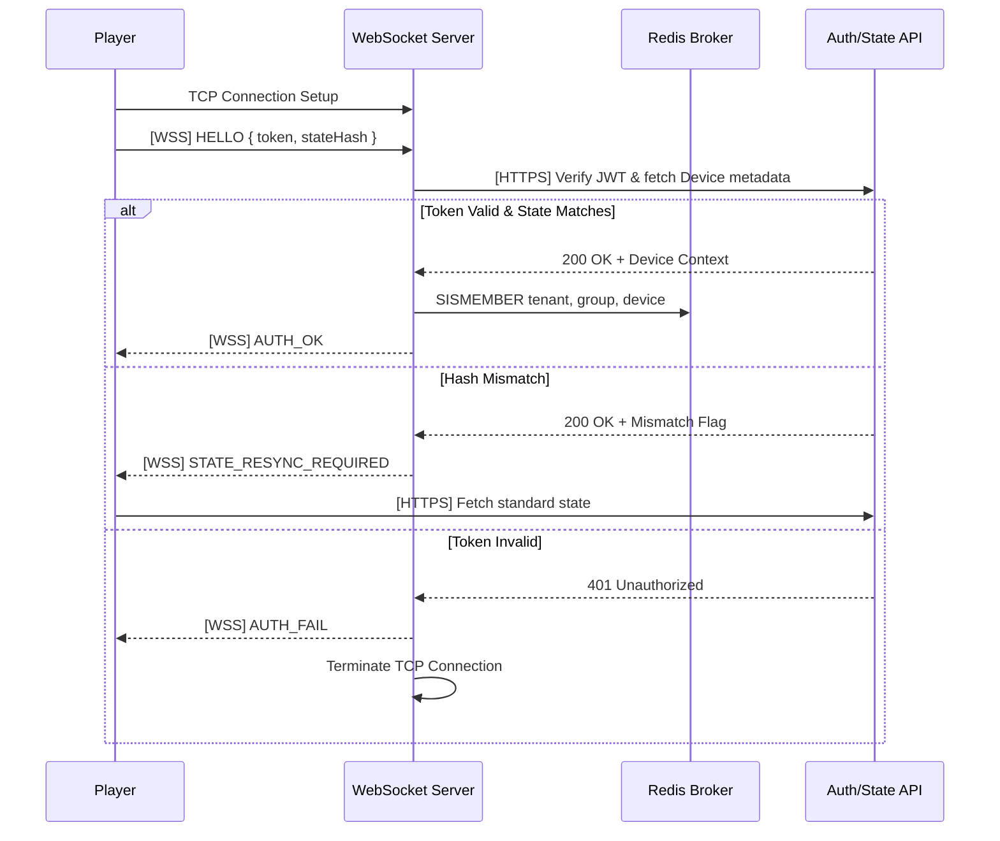
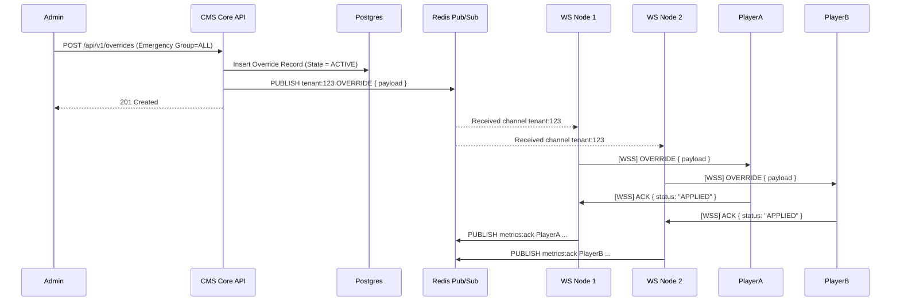
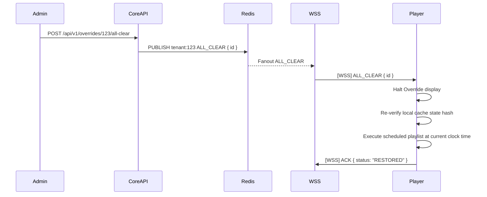
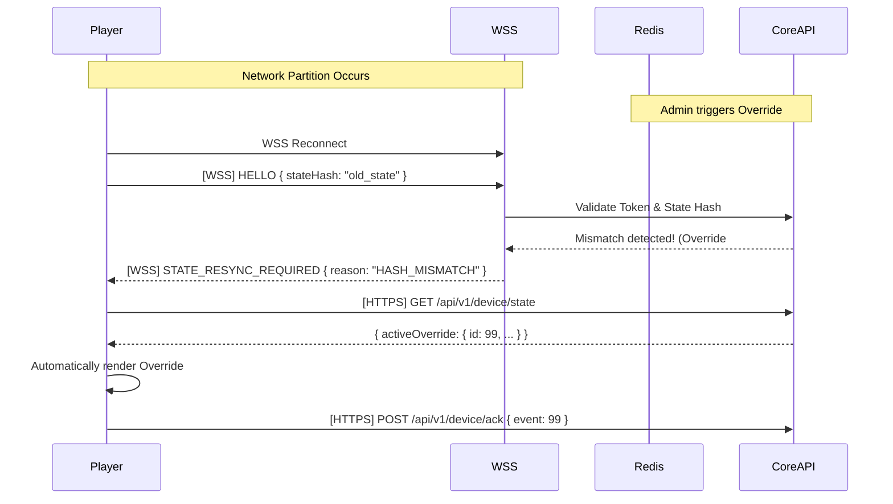

# Realtime Event Sequence Diagrams

## 1. Standard Connection & Authentication

## 2. Emergency Override Fanout

## 3. All-Clear & State Restoration

## 4. Reconnection & Missed Override Recovery

